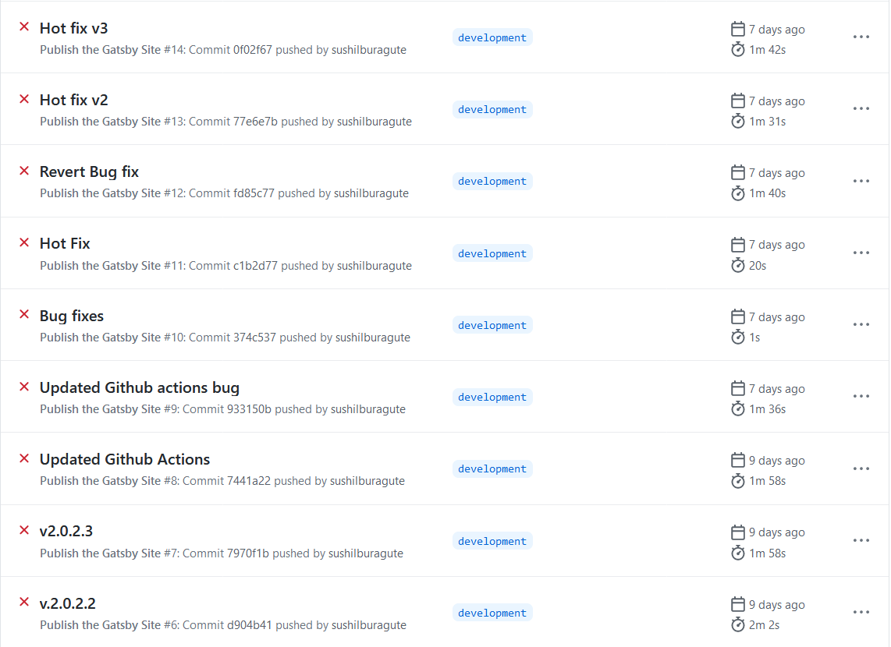
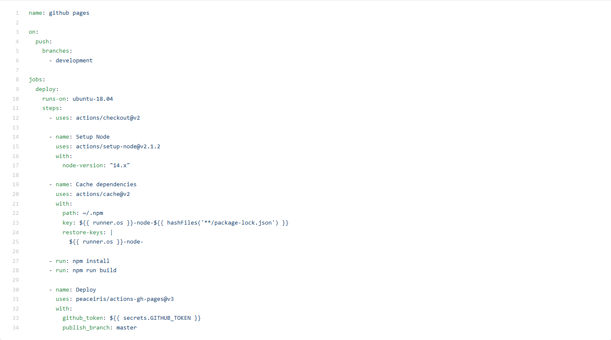
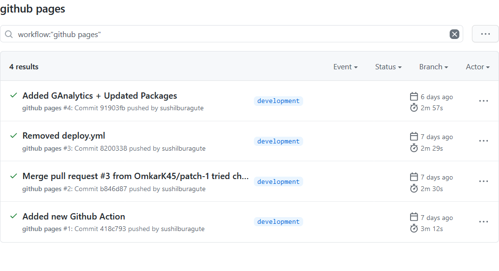

import { Callout } from "../../../src/components/atoms.js"

I sort of ran into a problem. I needed to manually build and deploy my portfolio website to github pages every time I made any changes to the codebase. That’s when I thought, let’s approach this with the mindset of an engineer and try to automate this process.

### Enter Github Actions

Well I did know about Github Actions, because every repo has a tab called Actions and I did my basic research for it. At this point I was intrigued, I grabbed my coffee at 2pm and started reading the docs and a few blogs on how I can approach the problem.

4 hours in, I had come across a solution via youtube, but it didn't work. It was a sign I was going to struggle with Github Actions for a long time, and I liked the challenge. I started hot-swapping code to see if I was missing something, rechecked my .env variables and still no success.



I pulled myself back at night, it was time to slow down and think over the problem instead of trying my luck. I watched a couple of youtube videos to better grasp at the concept. Here's the summary for you!

<Callout>
  💡 Tip: Wind down and think about a problem when you can't fix it!
</Callout>

### What is Github Actions?

In a sentence, Github Action is a tool which will automate your development process. It lets you build, test, and deploy your code right from GitHub. You can also assign code reviews, manage branches, and place issues the way you want with actions.

### Why do we need it?

Well, to save time. Get freedom from doing repetitive tasks. One such use-case I read about was about onboarding a new member to an open source project. Say a new member joins your open source project. Using Github actions, we can greet him, send him the contributing guidelines and resources based on the project. Another such use case is setting up your custom solution for CI/CD or testing the latest commit.

Github Actions is super flexible to your needs.

### How does it work?

Github actions are stored inside the `/.github/workflows` and are written in `.yaml` format. Here are the three pillars of Github Actions, collectively, these three pillars would make up most of the workflow.

#### **Name**

You can set the display name for your workflow by using `name`syntax. If you don't set any name, the default name would be the file's name.

```yaml
name: Test-Actions
```

#### **On**

`on` is a trigger for the Github Action to run. You can set your action to run on specific events like push to a branch, a new issue being created or a new pull request has just come in!

```yaml
on: push
```

```yaml
on: issues
```

```yaml
on: pull_request
```

#### **Jobs**

Okay now we know what triggers a Github Action, now how do we tell it to process something? We use the `jobs` keyword. There can be multiple 'Mini Jobs' under a job. Mind you, each job definition `runs-on` and `steps` are required.

```yaml
jobs:
  first-job:
    name: This job will run first
    runs-on: ubuntu-latest
    steps:
      - name: Prints a greeting
        run: |
          echo Hello World - ❤ Github Actions
```

### How I Implemented it for my portfolio website!



<Callout>Google, Docs, Open Source, Youtube to the rescue!</Callout>

#### Declaration of Action

```yaml
name: github pages

on:
    push:
		branches:
		- development

```

I declared my Github Action with the name "github pages". And I added a trigger to run this action whenever I commit to the `development` branch of my repo.

#### Setting up the job

```yaml
jobs:
  deploy:
    runs-on: ubuntu-18.04
```

I gave the name `deploy` to the job and then set it to run of v18.04 of Ubuntu on Github's Servers. After that, came to write the `steps` for the actions.

```yaml
steps:
	- uses: actions/checkout@v2

	- name: Setup Node
	uses: actions/setup-node@v2.1.2
	with:
		node-version: "14.x"

	- name: Cache dependencies
	uses: actions/cache@v2
	with:
		path: ~/.npm
		key: ${{ runner.os }}-node-${{ hashFiles('\*\*/package-lock.json') }}
	restore-keys: |
		${{ runner.os }}-node-

	- run: npm install
	- run: npm run build

	- name: Deploy
	uses: peaceiris/actions-gh-pages@v3
	with:
		github\_token: ${{ secrets.GITHUB\_TOKEN }}
		publish\_branch: master
```

Let's break down the code,

1. **actions/checkout@v2**

actions/checkout is an open-source code by github where it checks out your current repo so that the workflow is able to access it. Basically, it fetches all the branches and commits which are present in your repo, and allows you to perform tasks on them.

2. **actions/setup-node@v2**
   With this mini job, I've specified a node version on which the upcoming npm commands would take place on Github's Server.

   - `node-version` - is used to set the version of node to be used.

3. **actions/cache@v2**
   This action allows caching dependencies and build outputs to improve workflow execution time.

   - `path` - A list of files, directories, and wildcard patterns to cache and restore.
   - `key` - An explicit key for restoring and saving the cache.
   - `restore-keys` - An ordered list of keys to use for restoring the cache if no cache hit occurred for key
   - `Via the docs`

4. **npm install**
   This command installs on the dependencies required for the codebase to run.

5. **npm run build**
   This command builds the project and makes it ready for deployment.

6. **peaceiris/actions-gh-pages@v3**
   It's the Github Action I'm using to deploy the files generated in the previous step to the `master` branch in my repo. (Power of Open Source + Abstraction!)

   - `github_token` - Shh it's a secret token which grants access to the repo.
   - `publish_branch` - It's the target branch for the built files to be pushed.

### Conclusion

After a day since I took up the challenge, I was able to automate my deployment process! With the time I spent learning github actions, I'm sure I've become pretty good at making up my own Github Actions. If you have found this useful, please consider recommending and sharing it with other fellow developers!



You can check the `gh-pages.yml` file mentioned in the blog [here](https://github.com/sushilburagute/sushilburagute.github.io/blob/development/.github/workflows/gh-pages.yml).
